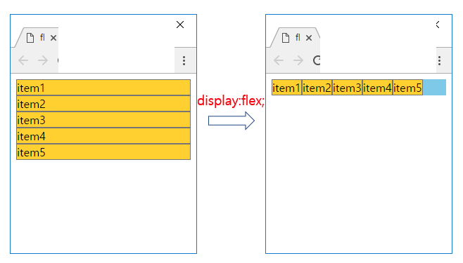
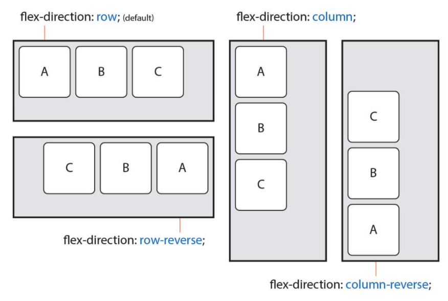

# React study

### Forms

1. Decide on Components
2. Decide the State and where it lives
3. What changes when state changes

### Structure

/signin 주소에 `SignInAndSignUpPage` 컴포넌트를 만들고,
그 안에서 `<SignIn />` 컴포넌트 작성

`<form>` 태그에 onSubmit 이벤트 생성하고 <FromInput> 컴포넌트로 입력값 받음
handleChange 이벤트로 글씨 입력시마다 해당 값을 바꿈
onSubmit 이벤트로 form 제출!

### event.preventDefault()

기본으로 정의된 이벤트를 작동하지 못하게 하는 메서드
예로 `<a>. <input>, <textarea>` 동작 막음 (a; 링크값으로 이동시켜주는 기본기능을 막음)

### 이벤트 중단 시에 사용되는 방식

`event.preventDefault()`
현재 이벤트의 기본 동작을 중단한다.

`event.stopPropagation()`
현재 이벤트가 상위로 전파되지 않도록 중단한다.

`event.stopImmediatePropagation()`
현재 이벤트가 상위뿐 아니라 현재 레벨에 걸린 다른 이벤트도 동작하지 않도록 중단한다.

`return false`
jQuery를 사용할 때는 위의 두개 모두를 수행한 것과 같고,
jQuery를 사용하지 않을 때는&nbsp;event.preventDefault() 와 같다.

### custom button

```css
dlsplay: flex; // flexible
flex-direction: column;
```

 <br/>


[그림 출처 및 설명 더 보기-flex](https://thrillfighter.tistory.com/489)

[그림 출처 및 설명 더 보기-derection](https://heropy.blog/2018/11/24/css-flexible-box/)

<br/>

### firebase

https://firebase.google.com/docs/web/setup
[google login](https://firebase.google.com/docs/auth/web/google-signin)
[current user](https://console.firebase.google.com/u/0/project/anything-55a61/authentication/users)

### Get the currently signed-in user

https://firebase.google.com/docs/auth/web/manage-users?hl=en

```javascript
// The recommended way to get the current user is by setting an observer on the Auth object
firebase.auth().onAuthStateChanged(function (user) {
  if (user) {
    // User is signed in.
  } else {
    // No user is signed in.
  }
});

// call current user, if there is not, current user is null
var user = firebase.auth().currentUser;
```
